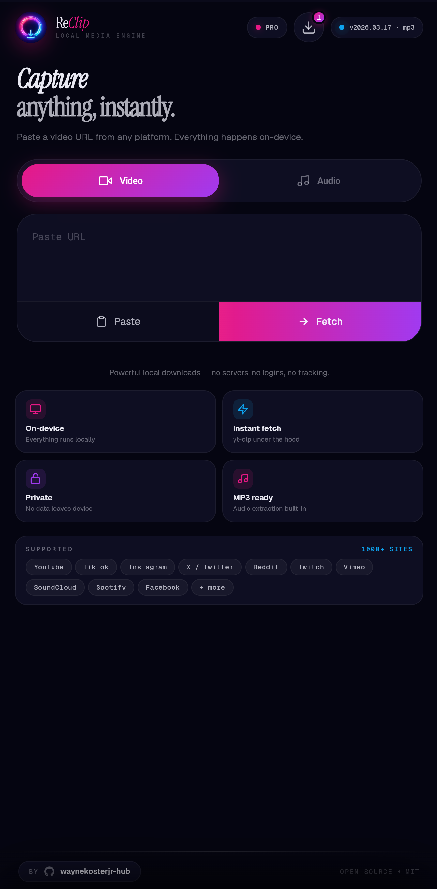
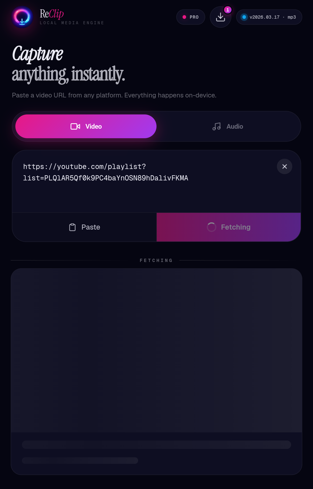
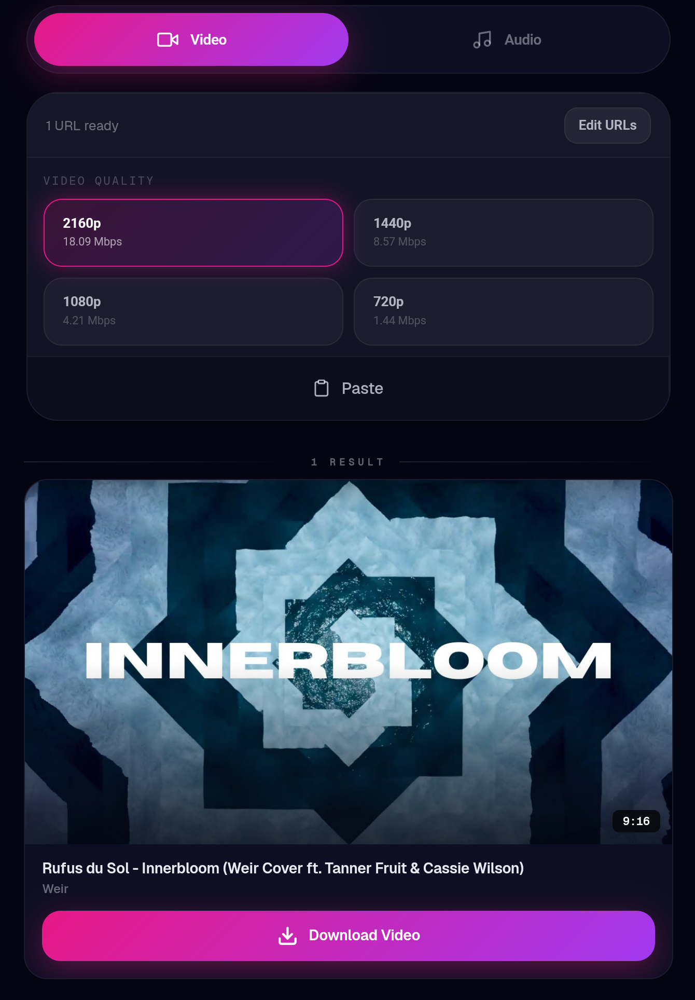
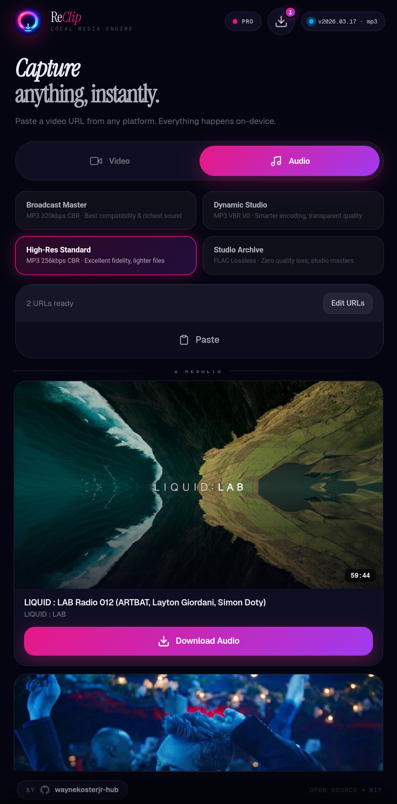
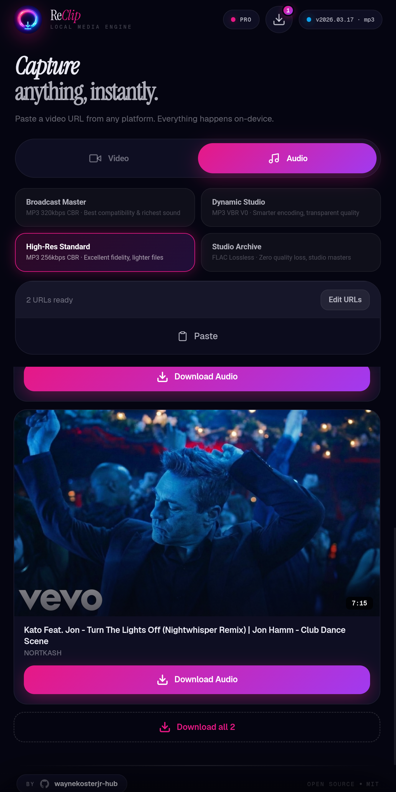
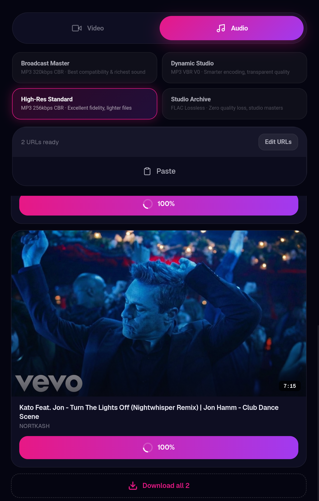
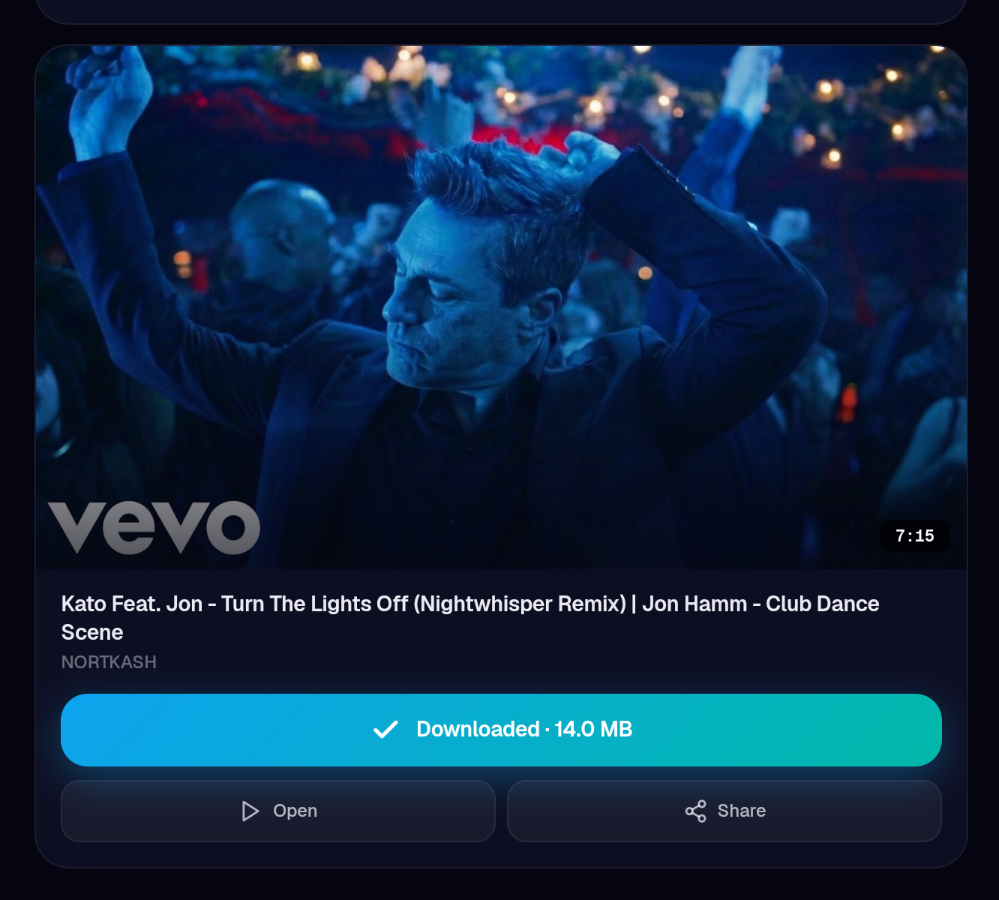
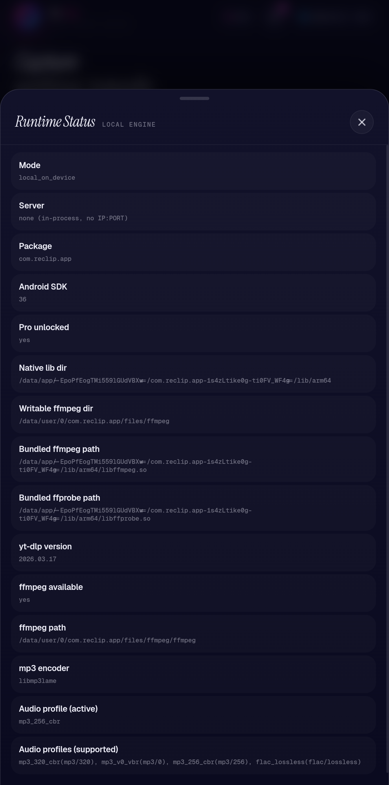
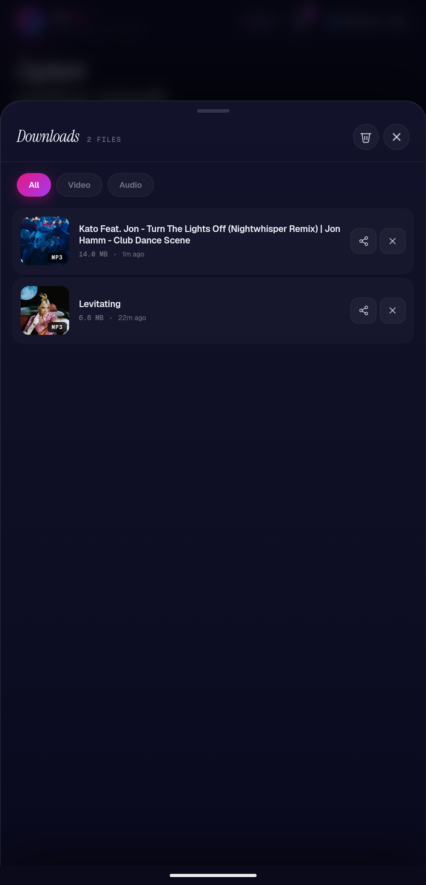

# ReClip ✨

Neon-styled, local-first media downloading for Android.

ReClip fetches media metadata and runs downloads on-device (yt-dlp + FFmpeg), with a clean share-to-download flow and Pro audio controls.

## Why ReClip 🚀

- On-device pipeline: no external conversion servers
- Fast URL/share handling with streamlined fetch UX
- Unified quality controls for video and audio workflows
- Runtime diagnostics and download history built in
- RevenueCat Pro gating for premium audio extraction

## Core Capabilities 🎯

- Video downloads with source-based quality options
- Audio downloads with selectable Pro profiles:
  - `mp3_320_cbr`
  - `mp3_v0_vbr`
  - `mp3_256_cbr`
  - `flac_lossless`
- Persistent per-device quality preferences
- Share routing:
  - Spotify links route to Audio
  - `music.youtube.com`, `m.youtube.com`, `youtu.be` route to Audio for Pro users
- Downloads saved to `Downloads/ReClip`

## Product Walkthrough (UI) 📱

### 1) Home screen (ready state)


### 2) Fetch in progress


### 3) Video mode with collapsed input + quality picker


### 4) Audio mode with Pro profile picker


### 5) Batch audio actions


### 6) Download progress state


### 7) Download complete actions (open/share)


### 8) Runtime status panel


### 9) Downloads history sheet


## Build Requirements 🛠️

- JDK 21
- Android SDK + Build Tools
- Gradle wrapper (included)

## Build & Install ▶️

```powershell
.\gradlew.bat :app:assembleDebug
.\gradlew.bat :app:installDebug
```

## Notes 🔐

- Pro audio features depend on active RevenueCat entitlement mapping.
- Spotify support requires build-time credentials:
  - `SPOTIFY_CLIENT_ID`
  - `SPOTIFY_CLIENT_SECRET`

## Branch / CI 🌿

- Active branch target: `Codex`
- GitHub Actions workflow publishes APK artifacts on successful runs

## License 📄

MIT
