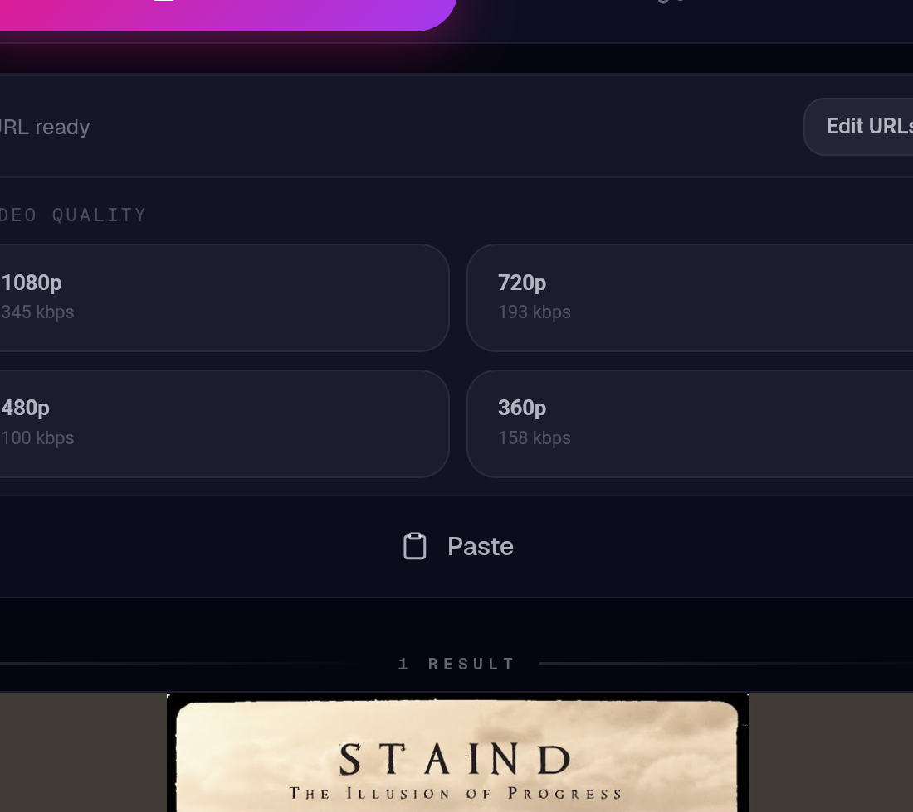
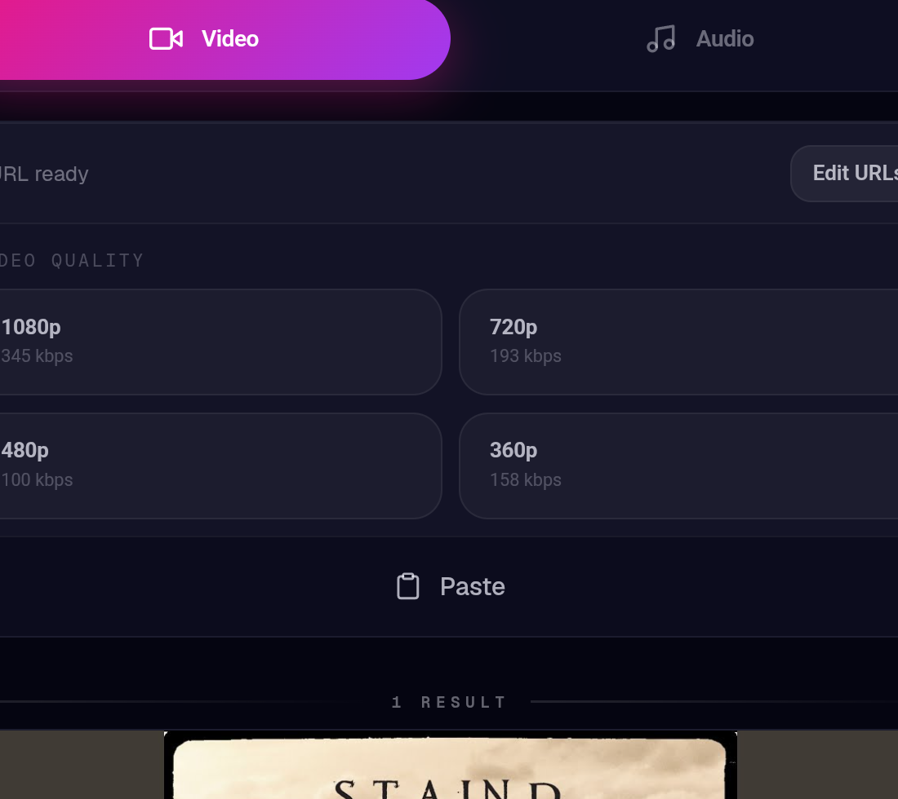
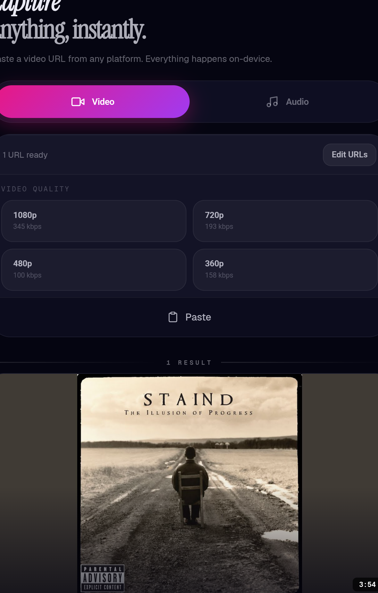

# RECLIP ✨

> Neon-fast, local-first media downloads for Android.  
> Built for a clean, powerful flow: paste ➜ fetch ➜ pick quality ➜ download.


## 🚀 What ReClip Does

- 🎬 Download video in source-available resolutions
- 🎵 Download audio with Pro processing profiles
- 🔗 Handle app-to-app sharing (Spotify + YouTube-family links)
- 📊 Show live progress + runtime diagnostics
- 📁 Save everything to `Downloads/ReClip`

## 💡 Why ReClip

- 🛡️ Local-first processing for privacy and reliability
- ⚡ Fast share-to-download workflow
- 🎛️ Clear quality controls for video and Pro audio
- 💳 Native Android billing + entitlement flow with RevenueCat

## 🧠 Current Highlights (Codex Branch)

- Paste-to-fetch UX:
  - URL paste can auto-fetch
  - URL box collapses after successful fetch
  - Fetch button hides after successful fetch
- Single video quality control point:
  - Top 4 highest video quality options shown in the collapsed input area
  - Video quality buttons visually match audio profile buttons
  - Video quality preference persists per device
- Pro audio profiles:
  - `mp3_320_cbr`
  - `mp3_v0_vbr`
  - `mp3_256_cbr`
  - `flac_lossless`
- Persistent audio profile preference (per-device)
- Runtime Status panel includes:
  - yt-dlp version
  - FFmpeg availability/path
  - MP3 encoder support
  - Active audio profile
  - Supported audio profile summary
- Pro-aware share routing:
  - Spotify links auto-route to Audio
  - `music.youtube.com`, `m.youtube.com`, and `youtu.be` auto-route to Audio for Pro users
- Stale fetch safety:
  - In-flight fetch responses are ignored after clearing URLs

## 🖼️ UI Screens

### Video Quality Picker


### Audio Quality Picker


### Runtime Stats Panel


## 🛠️ Build Requirements

- JDK 21
- Android SDK + Build Tools
- Gradle wrapper (included)

## ▶️ Build & Install

```powershell
.\gradlew.bat :app:assembleDebug
.\gradlew.bat :app:installDebug
```

## 🔐 Notes

- Pro audio features depend on active RevenueCat entitlement mapping.
- Spotify support requires build-time credentials:
  - `SPOTIFY_CLIENT_ID`
  - `SPOTIFY_CLIENT_SECRET`

## 🌿 Branch / CI

- Active branch target: `Codex`
- GitHub Actions workflow publishes APK artifacts on successful runs

## 📄 License

MIT
